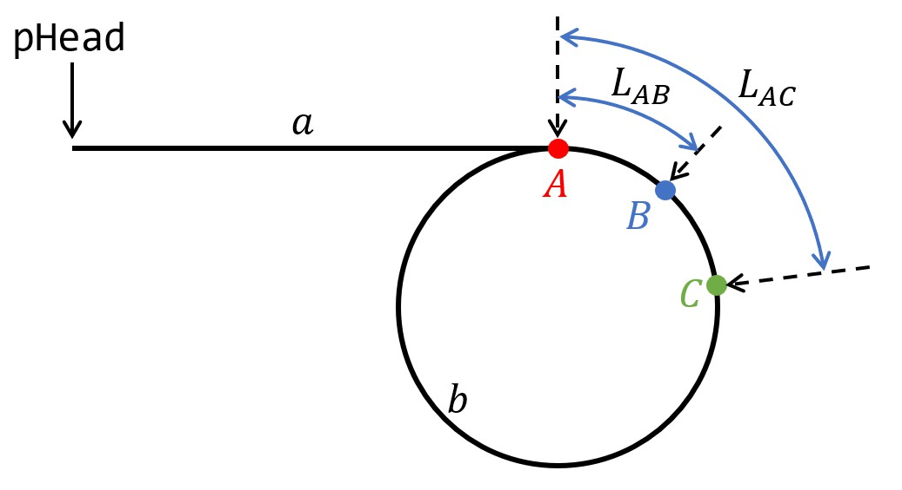

<head>
    <script src="https://cdn.mathjax.org/mathjax/latest/MathJax.js?config=TeX-AMS-MML_HTMLorMML" type="text/javascript"></script>
    <script type="text/x-mathjax-config">
        MathJax.Hub.Config({
            tex2jax: {
            skipTags: ['script', 'noscript', 'style', 'textarea', 'pre'],
            inlineMath: [['$','$']]
            }
        });
    </script>
</head>


这篇博客的重点是说明**方法2**，并证明其可行性。

题目：给一个链表，若其中包含环，请找出该链表的环的入口结点，否则，输出null。

链表node定义
```C++
struct ListNode {
    int val;
    struct ListNode *next;
    ListNode(int x) :
        val(x), next(NULL) {
    }
};
```

## 方法1

利用辅助数据结构`set`，思路比较简单，直接给出代码

```C++
class Solution {
public:
    ListNode *EntryNodeOfLoop(ListNode *pHead) {
        unordered_set<ListNode*> st;
        while(pHead) {
            if(st.find(pHead) == st.end()) {
                st.insert(pHead);
                pHead = pHead->next;
            } else {
                return pHead;
            }
        }
        return nullptr;
    }
};
```

## 方法2

这是这篇博客的重点，先给出思路

先说明一些定义，起始节点定为`pHead`

### 算法思路

1. 定义`fast`和`slow`指针，分别指向`pHead`；
2. 如果`fast`和`fast->next`均不为空，使`fast`指针前进两步，`slow`指针前进一步，即`fast = fast->next->next; slow = slow->next`，直到`fast`和`slow`重合；
3. 判断第二步终止的情况，如果`fast`或`fast->next`为空，则返回`nullptr`，否则，进行下一步；
4. 使`fast`指回`pHead`，然后依次使`fast`和`slow`指针前进一步，直到`fast`和`slow`指针重合，这是两个指针均为环入口结点。

### 证明

无环的时候显然成立，不需证明。

当有环的时候，如下图所示



在图中，假设非环部分长度为$a$，环的长度为$b$

当`slow`指针指到$A$点后，`fast`指针前进的距离为$2a$，假设此时`fast`指针在$B$点（$B$点可能与$A$重合），则$L_{AB}$的长度为$(2a-a)\%b=a\%b$，其中，$\%$符号为取模。

假设`slow`指针又走了$n$步后与`fast`相遇，这是`fast`走了$2n$距离，假设相遇点为$C$（$c$与$A$和$B$都有可能重合）

从`slow`指针的角度看
$$
L_{AC}=n\%b
$$

从`fast`指针的角度看
$$
L_{AC}=(2n+L_{AB})\%b = (2n+a\%b)\%b
$$

二者相等，得到
$$
n\%b = (2n+a\%b)\%b
$$

将$a\%b$也可以表示为$a-k_1b$，$(2n+a\%b)\%b$表示为$2n+a\%b-k_2b$，$n\%b$表示为$n-k_3b$，其中$k_1, k_2, k_3$为整数，是为了表示取模运算而取的，所以，上式可以表示为
$$
n=(k_1 + k_2 + k_3)b - a
$$

所以，$L_{AC}$也可以表示为
$$
L_{AC} = (k_2 - k_3)b - a
$$

`fast`和`slow`相遇之后，将`fast`指针指回原点，再走$a$步，`slow`指针的位置为
$$
(a+L_{AC}) \% b = (a + (k_2 - k_3)b - a) = 0
$$

所以，当`fast`指针前进$a$步后，即再次到达$A$点后，`slow`指针也再次指到$A$点，即两个指针相遇后就是环的起点。